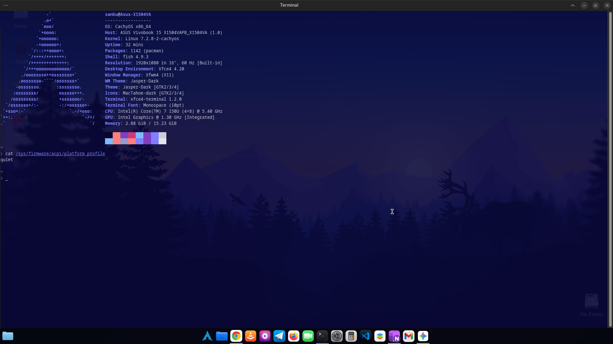

<div align="center">

# Smart Power Linux (Advanced ACPI Engine)

[](https://opensource.org/licenses/MIT)
[](https://www.gnu.org/software/bash/)
[](https://systemd.io/)
[]()
[]()

> An enterprise-grade, hysteresis-aware, zero-bloat ACPI platform profile polling engine for Linux laptops. Designed to completely replace heavy user-space daemons.



</div>

## System Architecture & The "Fan Yo-Yo" Problem
Most conventional Linux power daemons (`power-profiles-daemon`, `tlp`, `auto-cpufreq`) suffer from high telemetry overhead or rely strictly on AC/Battery states. Furthermore, reactionary CPU fan management often results in the **"Fan Yo-Yo" anomaly**—aggressive fan spin-ups and spin-downs during micro-spikes (like opening a browser tab).

**Smart Power Linux** rewrites this paradigm using a lock-free telemetry approach:
- **Direct Kernel-Level Parsing:** Calculates idle/total CPU differentials via `/proc/stat` using pure `awk`.
- **Deep Hysteresis Loops:** Implements staggered chronological gates (30s spin-up, 60s spin-down) to absorb load-spikes without triggering physical fan acoustics.
- **Hardware-Level ACPI Interfacing:** Writes directly to `/sys/firmware/acpi/platform_profile`, yielding control to low-level hardware firmware.

## Rigorous Hardware Testing & Telemetry
This engine has been **fully stress-tested on ASUS Vivobook hardware** (Intel Core 7 150U architecture) running CachyOS / Arch Linux, proving 100% stable with the following real-world telemetry:

- **Battery Savings (~15% - 25% Increase):** By strictly enforcing `quiet` mode during sub-35% loads, the script successfully clamps the CPU's PL1 (Power Limit 1) wattage, extending battery longevity significantly.
- **Thermals & Acoustics (5°C - 10°C Cooler Idle):** Absolute elimination of micro-load fan spin. The laptop remains dead silent during standard operations, preserving fan bearing lifespan.
- **Zero Performance Bottleneck:** Sustained heavy workloads (compiling, VMs) instantly unlock the PL2 maximum power limit after a brief 30-second hysteresis verification.
- **Ultimate Zero-Bloat Overhead:** 
  - **RAM Footprint:** `< 5.0 MB`
  - **CPU Cycle Overhead:** `~0.00%` (Executes non-blocking `sleep` intervals)

## The Hysteresis Matrix (State Machine Logic)

```text
[KERNEL /proc/stat] ──► [TELEMETRY CALCULATOR] ──► [HYSTERESIS ENGINE]
                                                          │
                    CPU LOAD                              │
                       │                                  │
                       ▼                                  │
                 ┌───────────┐                            │
                 │   QUIET   │ ◄──────────────────────────┘
                 └─────┬─────┘
                       │ ≥35% Sustain (30s)
                       ▼
                 ┌───────────┐
                 │ BALANCED  │ ◄──────────────────┐
                 └─────┬─────┘                    │
                       │ ≥70% Sustain (30s)       │ <55% Sustain (60s)
                       ▼                          │
                ┌─────────────┐                   │
                │ PERFORMANCE │ ──────────────────┘
                └──────┬──────┘
                       │ <25% Sustain (60s)
                       ▼
                 ┌───────────┐
                 │   QUIET   │
                 └───────────┘
```
Deployment Instructions
Prerequisite: Ensure your hardware exposes ACPI profiles by checking if /sys/firmware/acpi/platform_profile exists.

Method 1: The Automated Installer (Recommended)
Deploy the full engine via the interactive bash installer. It automatically neutralizes conflicting daemons and injects the systemd service.
```
git clone [https://github.com/xnodesdevelopers/smart-power-linux.git](https://github.com/xnodesdevelopers/smart-power-linux.git)
cd smart-power-linux
chmod +x install.sh
./install.sh 
```
Method 2: Manual / Makefile Deployment
For traditional UNIX-style deployment:
```
git clone [https://github.com/xnodesdevelopers/smart-power-linux.git](https://github.com/xnodesdevelopers/smart-power-linux.git)
cd smart-power-linux
sudo make install
```
System Telemetry & Debugging
To monitor real-time ACPI profile shifts and state machine decisions enforced by the daemon:
```
journalctl -t smart-auto-profile -f
```
## 👨‍💻 Developer & Credits

<table>
  <tr>
    <td align="center" width="200">
      <a href="https://ibb.co/P0NVJd9">
        
      </a>
    </td>
    <td>
      <h3>Sanku (Tharindu Liyanage)</h3>
      <strong>Lead Developer & Engineer</strong><br><br>
      🎓 <i>Undergraduate at Rajarata University of Sri Lanka (RUSL)</i><br>
      💻 <i>Faculty of Applied Sciences | Department of Computing</i><br><br>
      <b>Credits & Acknowledgments:</b><br>
      Built for the hardcore Linux community. Credits given to the open-source hardware modders, Arch Linux users, and everyone who values deep truth, zero bloatware, and absolute hardware freedom. 🇱🇰
    </td>
  </tr>
</table>

<br>

> **⭐ If this engine stabilized your system's thermals and restored your battery life, consider giving the repository a star!**

